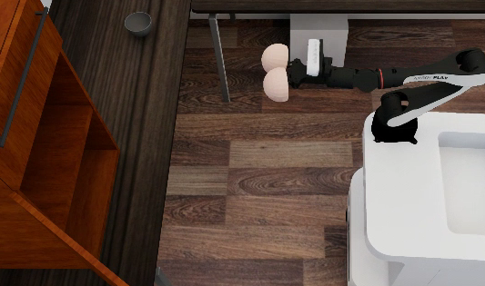
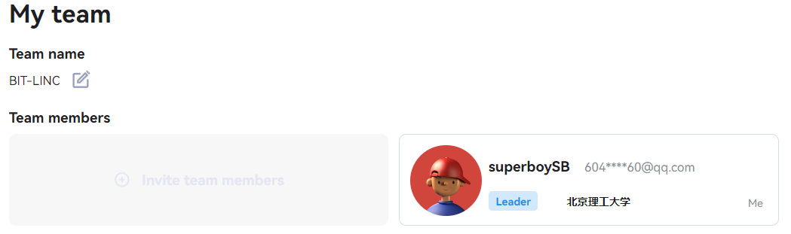
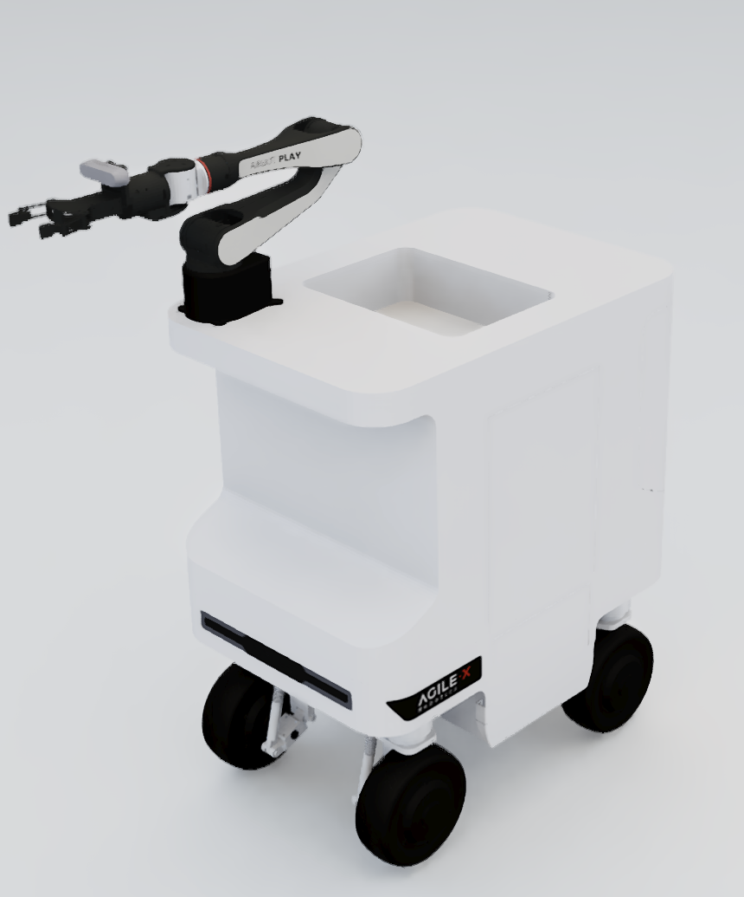

# ICRA AgileX Sim2Real Challenge
Solution of BIT-LINC team 

<div align="left">
  
</div>
<div align="left">
  
</div>

## What's News!!!
The simulation stage of the competition has begun. Please submit your client-side Docker image to the team's Docker Hub, following GitHub's instructions. Additionally, submit your Docker Hub account and operation instructions of your client docker to the organizing committee via “Mail" section of the website before 23:59 on March10. The organizing committee will evaluate the competition based on the code submitted by the team. Teams must also submit a technical report. The template for the report can be downloaded from the Data section of the website and should be sent to sim2real@air.tsinghua.edu.cn before 11:59 pm on March 14. The results of the simulation phase will be determined by a "test result: technical report" ratio of 7:3. Final scores will be published on March 15 via the website.

## Install 
git clone
```sh
git clone https://github.com/superboySB/AXS2024 && cd AXS2024 && sudo chmod a+x scripts/*
```
Build two containers, one for Omni Gibson and one for our method (based on the baseline). They will automatically pull the image and require as recent a graphics card driver as possible (>=535).
```sh
./scripts/run_omni.sh

# You can also directly pull the image locally, for example: 
# docker build -t superboysb/axs2024:20240309 .
./scripts/run_our_solution.sh
```
For ROS-related topics, you can first refer to the [official tutorial](docs/sim2real-install-guide.md)。

## Running Simulation
Enter the containers for OmniGibson simulation and start the simulation, ensuring the `DISPLAY` is set correctly.
```sh
conda activate omnigibson && cd /omnigibson-src

roscore & python -m omnigibson.AXS_env --ik
```
Start the ros TF publisher.
```sh
roslaunch airbot_play_launch robot_state_publisher.launch robot_description_path:=/root/OmniGibson-Airbot/omnigibson/data/assets/models/airbot_play_with_rm2/airbot_with_texture/urdf_obj/AIRBOT_V3_v2-3.urdf

roslaunch airbot_play_launch static_transform_publisher.launch
```
Start the IK service.
```sh
roslaunch airbot_play_launch airbot_play_moveit.launch use_rviz:=true target_moveit_config:=airbot_play_v2_1_config use_basic:=true
```
[Optional] Attempt keyboard control (issue: I found that 3/4 corresponding joints do not respond, preventing the robotic arm from reaching out).
```sh
python /root/OmniGibson-Airbot/teleop_twist_keyboard_AXS.py
```

## Run our solution
Enter another container corresponding to our algorithm and successively start the `hdl localization` node, the `base control` node, and the `main solution service` node in multiple consoles, ensuring the `DISPLAY` is set correctly.
```sh
cd ~/Workspace/AXS_solution

roslaunch hdl_localization hdl_localization.launch

conda activate baseline && python /root/robot_tools/examples/ros_base_control.py

conda activate baseline && python /root/Workspace/AXS_baseline/ICRA2024-Sim2Real-AXS/src/airbot/example/AXS_solution.py
```


## Submit my results
Submitting images requires registering for the ICRA2024-Sim2Real-RM challenges.

Players create a personal docker hub account,create repository in Repositories, and save your Repository Name.

If players already have an account,they can directly enter their account password to log in:
```sh
docker login
```
After logging in, use the following command to view the image ID that needs to be submitted：
```sh
docker images
```
Then change the name of the image that needs to be submitted：
```sh
docker tag {image_id} superboysb/axs2024:{version}
```
Submit to dockerhub:
```sh
docker push superboysb/axs2024:{version}
```
**Copy files from/to server/client containers**. You may refer to [this page](https://docs.docker.com/engine/reference/commandline/cp/) for copying files between containers and the host.Normally, when you need to update sources in the containers, you should change the source codes in this repo and refer to [this part](https://github.com/AIR-DISCOVER/ICRA2024-Sim2Real-RM#build-an-updated-client-image) to build an updated image. Directly copying files into containers should be used for debugging only.

## Reference
The whole project is in the docker containers from the [original repo](https://github.com/AIR-DISCOVER/ICRA2024-Sim2Real-AXS) for introduction.

<div align="center">
  
</div>


