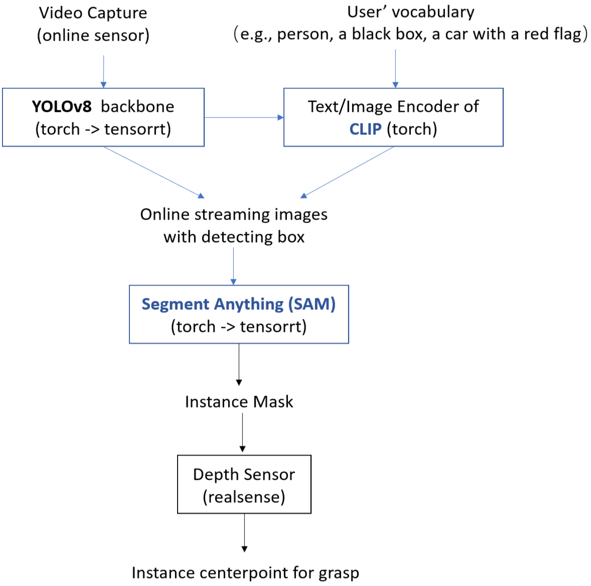

# 北京理工大学 BIT-LINC AXS技术报告
以下分两部分阐述BIT-LINC队伍目前的方案开发现状、以及后续拟采用的方案。
## 仿真器调试阶段
以下介绍仿真器调试阶段采用的自动识别、定位、运动规划和智能决策等算法，并指出算法的性能。
### 自动识别
初赛由于时间有限，我们在自动识别方面做的比较多，虽然场景的物体比较简单，但是由于摆放位置随机、并且角度随机，如果我们使用，时不时会出现下面这种不太容易识别到的角度，这时候对于传统的YOLO方法来说就会很通过一个固定的label来加以应对。

  

所以我们在这里使用的还是一些现在基于大模型的开集检测方法，我们可以通过一些带有属性的词语，比如`Open-top Bowl Near Gaming Accessory`，维护很多个这样的词语来描述我们要抓取的物体，然后识别置信度最高的框。具体地，我们确实是尝试了baseline给的Grounding Dino，但这个模型如果假设端侧部署，部分算子的优化难度很大，实测发现不够实时，摄像头界面明显卡顿，如果我们当前需要一个频率比较高的感知能力，不够合适。因此我们换成了以YOLO为backbone，外加CLIP作为开集能力增强，类似YOLO-world框架，并且考虑了ONNX/TensorRT加速，从而让仿真器里我们当前的推理速度达到每秒50帧左右，更容易应对突发情况(比如杯子掉落、夹爪卡住)，相当于直接得到了一个传感器级别的识别模块。

### 定位
定位方面，底盘部分目前用的还是hdl localization框架去基于lidar与imu做局部信息下的定位估计，在实际测试的时候发现有时候会出现在一个很小的范围内自己成环的轨迹，我们对此进行了一定的调参处理，尽量避免这种情况。

  

在抓取方面，目前基于一个端侧上同样tensorrt优化后的Segment Anything分割大模型来做，比原有的fast sam在精度上要高很多（基本逼近原版SAM），而速度上还要快4-5倍，基本结合前面的开集检测，我们实时做实例分割是没有问题的。在这样的支持下，我们取出mask范围内的realsense深度数据，描绘一个点云网格，并以此估计物体质心，用于后续抓取。

### 运动规划
运动规划目前采用DWAPlannerROS模块，利用前面定位模块的相对估计进行一个路径规划；在抓取方面，得到质心后，先让末端移动到物体质心上方，然后使用moveit对前面各个关节的位姿轨迹进行解算。我们发现IK有时候会有解算失败的情况，往往是因为物体的距离过远或者过近的原因，我们也会实时判断并准备几个候选的位置进行尝试，避免解算失败后，机器人直接原地摆烂。

  

### 智能决策
目前这个系统本质上还是以智能感知为主的规则驱动，这是因为目前微波炉、柜子、桌子和物体生成的范围基本都是固定的，用相应的目标位姿再加以TF就可以形成一个pipeline。这里唯一的随机性就是不同颜色的碗和杯子需要准确的抓取，此时需要用到前面提到的模块，组合成一个开集检测、定位抓取的实时系统。

  

我们的方案在初赛的仿真自测中最好成绩如下，还有很大改进空间。

  

## Sim2Real调试阶段
以下介绍Sim2Real调试阶段拟采用的自动识别、定位、运动规划和智能决策等算法，并详细阐述如何消除真实环境与仿真环境间的各类偏差（视觉偏差和系统动力学偏差等）对算法性能的影响。
### 自动识别
目前初赛的自动识别方案效果和实时性都是非常不错的，十分期待在复赛中能不能也沿用这种prompts的方式对实例进行刻画，我们引入冗余的描述和label都不会影响整个系统的实时性，因为我们只有在切换task的时候才需要推理CLIP，其余时间基本复杂度等于yolo，这个设计希望在复赛阶段看到更多的潜力，特别是解决视觉偏差方面。

### 定位
在定位方面，依赖底盘的lidar和imu进行长时间的定位估计可能不容易应对一些意外情况（比如机器人被柜子弹出一点距离），此时一方面仍然可以通过调参的方式来correct the estimated pose，我们还可以尝试用前面强大的视觉模块、结合realsense识别一些常见家具（比如柜门把手、微波炉按钮、固定块）的位置，去进行粗略的视觉定位，与我们下方的底盘定位进行融合，得到一个更加准确的定位效果。除此之外，对于柜门和微波炉的边侧，可以考虑引入affordace map来尝试得到一些更加通用的common knowledge，来提高“标定+规则”以外的泛化性。

### 运动规划
我在初赛尝试了graspnet和anygrasp的改进版，不过对于当前这几种物体的抓取感觉没有特别大的改进效果，考虑到实机系统可能更加复杂、物体抓取难度和意外情况也会更多，我会继续考虑用这些方式，因为不是所有的物体都适合从正上方开始抓取，如果给6自由度的位姿，也会更好的释放moveit的能力，解决一些系统动力学上难以求解的问题。

### 智能决策
我在官方的project里面看到了很多LLM的接口，如果复赛的场景更加开放、随机的话，我会考虑引入更多的场景理解模块与底层模块封装，然后尝试用LLM来分解任务pipeline，替代一些比较复杂、难以让人清晰定义的规则，增加机器人的智能性。